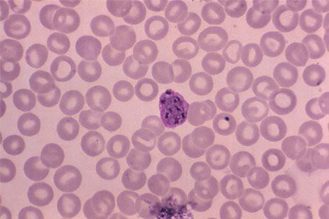

# Malaria-Detection
A system designed to recognize malaria parasitized cells.

# How dangerous is Malaria?
Malaria is a potentially fatal disease caused by Plasmodium parasites transmitted to people through the bites of infected female Anopheles mosquitoes, known as malaria vectors. It has existed for 30 million years, and has been identified as being a major cause of death in ancient civilizations worldwide. Today, Malaria continues to be a serious disease, with nearly half of the world’s population being at risk, although the WHO has identified the African region as carrying a disproportionately high share of the global malaria burden, with the region being home to 92% of malaria cases and 93% of malaria deaths in 2017.

# The process usually followed
Malaria parasites can be identified by examining a sample of an infected patient’s blood under an optical microscope. Prior to examination, the sample is spread across a microscope slide, and stained with a dye mixture that enhances the contrast of the plasmodium parasite in the patient’s red blood cells . This technique is accepted as standard by health authorities worldwide, and possesses acceptable accuracy and cost-effectiveness, but is also time and labour-intensive, as well as highly dependent on the experience of the technician.

# Plasmodium vivax parasites infesting red blood cells

# Dataset
Complete dataset: https://drive.google.com/file/d/1lxVOmIyjpL0JITOA-06YSI_NMFIH3auz/view
This dataset contins the images to be used in processing, in coloured (RBG) format. As our only aim is to count the areas of the contours formed in the cell, we'll convert the images to black and white, for easy processing.

Processed dataset: https://drive.google.com/file/d/1azIYjzLFCY7qp7-NjgSBvakbGgPvQlRf/view
